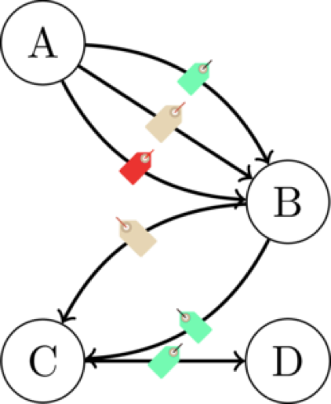

# Zilliqa设计构思-使共识更有效

在我们之前的文章中，我们介绍了为什么Nakamoto共识协议（或PoW）不理想以及为什么Zilliqa需要一个不同的共识协议。Zilliqa使用的共识协议被称为实用拜占庭容错（Practical Byzantine Fault Tolerance），简称pBFT，该协议具有计算成本低、在低能耗的情况下即可赋予交易最终性、提出下个区块无需确认等多个优点。

然而，卡斯特罗和利斯科夫（Castro and Liskov）在其论文（链接，<https://dl.acm.org/citation.cfm?id=296824>）中设计的经典pBFT 只有在共识组（在Zilliqa中指一个分片）较小时，例如少于50个节点，才具有较高的通信效率。当共识组变大，节点之间的通信成本将骤升从而成为效率的障碍。而我们此前的文章提到，Zilliqa中任何分片都必须有至少600个节点才能确保其中拜占庭节点（即恶意节点）的比例低于三分之一的概率非常低。

本文是此系列文章的终篇，我们将讨论经典pBFT协议对通信的要求有多高以及我们如何使用多重签名的方法来降低这个要求。

在本文中，我们将用n来表示共识组的大小， Zilliqa中n假设等于600。

## pBFT的通信成本

在此前提到的论文中，经典pBFT要求每个节点与所有其他节点通信共享协议消息，从而对系统状态达成一致。这意味着每个节点都必须发送n条消息，因此总的通信数量为n2，这一通讯成本是很高的。

## 认证消息的成本

此外，在拜占庭网络中仅仅发送消息是不够的。特别是在一个公开的拜占庭网络中，当节点A接收到来自节点B的消息时，A必须确定该消息确实由B发送，且该消息在传输过程中未被修改，没有这种保证，节点就很难确保消息的真实性，因为黑客可以在中间环节修改消息并给节点提供不正确的信息。

一种验证消息传输的解决方案是在A和B之间生成保密的密钥，然后可以使用该密钥为每个传出的消息生成“标签”。由于只有A和B知道密钥，所以标签只能由A或B生成，从而他们可以验证消息的来源。

消息认证码（Message Authentication Code，简称 MAC）是可以生成这种标签的加密方法。构建MAC的一种可能方式是使用加密散列函数（cryptographic hash function），该函数将密钥和消息作为输入并生成标签作为输出。

下图显示了发送者和接收者使用MAC的方式。发送者用消息和密钥通过MAC生成标签，并将其与消息一起发送给接收者。接收者再次计算MAC得到一个标签，将之与收到的信息进行比对，确认两者是否吻合，如吻合则该消息未被篡改。

然而，MAC和大多数对称密钥方法的问题在于，如果我们有n个节点，每对节点都需要一个密钥。因此，如果我们有n个节点，总共需要n（n-1）/ 2个密钥。

那么MAC的通信成本到底是多少？如果我们在网络中有4个节点A、B、C、D，当A要向整个网络即向B、C、D发送消息时，A要创建3个不同的标签因为A与B、C、D分别有不同的密钥。现在，假设A用B作为中继（relay）将标签传送到C和D，那么A将需要向B发送3个标签（参见下图） 。B在收到它的标签后，用C作为中继将A的标签转发给C和D时，它只会向C发送2个标签。以此类推，使用这种简单的基于中继的广播机制分发的消息总数为3 + 2 + 1 = 6。

此图显示出一条消息在网络中传输的方式。三种不同的颜色显示出A创建的三个不同的标签，A先将三个标签发送给B，B再将两个标签发送给C，最后C转发最后一个标签给D。

对于具有n个节点的网络，如果我们使用MAC，则以标签形式发送的消息总数为：（n-1）+（n-2）.. + 1 = n（n-1）/2。

## 采用公钥密码学提高效率

因为验证消息上的签名也可以确保该消息确实是由合法的发送者签发的，因此MAC实际上可以用数字签名来替代。卡斯特罗和利斯科夫之所以没有使用数字签名是因为，当时计算MAC比生成数字签名计算量便宜得多。如今，数字签名的计算量已经相当便宜。

而且，公钥密码学自身有很多优点。为了理解这一点，我们继续使用前面的例子。现在，我们假设A、B、C、D节点使用数字签名。因此当A发送消息时，它将签署消息并由此产生签名。请注意，A在这里不需要创建三个签名，只有一个就够了。然后签名被发送到下一个节点B，B在此只收到一条消息和相应的签名，B再发给下一个节点C。以此类推，在每个节点，只有一个签名被转发，在这种情况下分发的消息总数将为1 + 1 + 1 = 3。

对于具有n个节点的网络，如果我们使用数字签名，则所传递的消息总数将为：1 + 1 + 1 …（n-1）次= n-1。

最近有篇学术论文提出了用数字签名取代MAC的想法（链接<https://www.usenix.org/conference/usenixsecurity16/technical-sessions/presentation/kogias>）。

使用数字签名而不是MAC将发送消息的数量从二次方数量级减少到线性，当n很大时这种减少会产生重要影响。以600个节点为例，其中传播的消息数量可以从17.97万减少到599。

## 使用多重签名方案减少每个消息的大小

讲到这儿，你应该相信使用数字签名比MAC能更好地减少网络中需传输消息的数量了吧，那么接下来就让我们用数字签名来替换传统pBFT协议中的MAC。

现在的问题是，我们是否找到比数字签名更好的方法呢？答案是肯定的！数字签名确实还有一定的改进空间，我们会在未来的博客中更多地介绍这个内容。现在先让我们看一下数字签名有哪些可以改进的地方。

我们知道，pBFT赋予了交易最终性，这意味着一旦交易被提交到区块链，那么它就是最终的了且不会有临时分叉，因此不需要确认。交易之所以有最终性是因为，pBFT协议本身已要求每个区块必须由共识组中的绝对多数诚实节点签署。每个诚实的节点通过签名确认它已经验证了块的内容，确保交易有效。而在基于PoW的共识中，每个节点都可以生成一个区块，而网络的其他节点或接受或拒绝它，这就会导致临时分叉的产生。

具体的签名方法是：每个节点签署一个区块，然后将签过名的区块转发到网络的其余部分，之后其余节点都将自己的签名附加在这个区块上，最终在广泛传播后，这个区块就会获得绝大多数诚实节点的签名。如果网络中的每个节点（包括恶意节点）都对该区块进行签名，那么区块的签名数量为n，在这里我们就需要引入多重签名的概念了：

多重签名是一种密码术语，指的是把一条信息上的n个节点签署的n个签名整合到一个大小固定的签名上。

## 简化的多重签名是如何工作的呢？

在介绍细节之前，让我们先了解一下背景：在多重签名方案中，我们有n个签名者，每个签名者都有一对密钥（公钥和私钥）、一个验证签名的验证者和一个汇总各方“签名”的聚合者（aggregator）。为了便于理解，我们现在简单假设所有节点都是诚实的，并且会配合签署消息。

验证者在检验汇总后的签名时，会检查所有签名者是否都正确地签了名。仅当验证者确认所有签名者都正确地签了名之后，验证才算通过，反之则验证失败。

接下来让我们深入细节，请做好准备，因为这有些偏技术性。

多重签名方案基本上分两步进行。在协议的第一步中，每个节点将其公钥发送给聚合者，聚合者根据公钥的数学形式，通过简单的加法或乘法将之聚合为一个单一的公钥。

例如，聚合公钥= 公钥_1 + 公钥_2 + …+公钥_n。

然后聚合者将聚合公钥转发给验证者从而可以使后者验证聚合签名，与此同时聚合者也将聚合公钥发送给每个签名者让所有人签名。

在第二步中，聚合者启动与每个签名者的交互协议（interactive protocol）。这个交互协议总分包含三个阶段：

1. **提交阶段（Commit phase）**：此阶段每个节点生成一些随机内容并提交给交互协议。如果你不了解什么是加密提交（cryptographic commitment），那么可以通过这种类比的方式理解：每个节点都秘密地掷骰子，然后将结果写在一张纸上并将其放在一个盒子中锁好，最后发送给聚合者。聚合者无权打开盒子。

2. **挑战阶段（Challenge phase）**：此阶段聚合者首先使用加法或乘法将所有的提交聚合为一个聚合提交，然后使用它以及聚合公钥、消息生成一个挑战，再将挑战发送到所有节点。之后挑战可用于确认所有节点都知道公钥对应的私钥。这与常规数字签名的工作方式类似，即由签名证明签名人确实知道私钥。

3. **回应阶段（Response phase）**：所有节点为了应对挑战会向挑战发送私钥进行回应，之后聚合者将聚合所有的回应。因此回应可被视为签名者知道其公钥对应的私钥的证据。

因此，最后的聚合签名实际上是挑战和聚合回应的信息对，并能验证第一步生成的聚合公钥。

值得注意的是，聚合签名的大小不取决于签名者的数量，它是固定的。

图中蓝色的节点是聚合者。H是用于将消息m生成挑战的密码散列函数。聚合签名就是R和S的信息对。R的大小等于Ri，S的大小等于Si的。仅在知道私钥的情况下才能生成有效的回应。

当验证者检查聚合签名时，它检查的不是每个单独签名者是否都正确地遵守协议，而是检查所有签名者作为一个整体是否正确地遵守协议并知道私钥。因此，验证者做出的决定是全有或全无（all-or-nothing）。

目前一种比较流行的多重签名方案是基于Schnorr数字签名技术的并由于一篇学术论文（链接<https://arxiv.org/abs/1503.08768>）得到了关注，该论文在一些证人需要证明事件发生的背景下使用了这个技术。

## 结论

Zilliqa使用了近期一些学术论文中的技术来提高经典pBFT协议的效率。

本文的主要亮点是多重签名协议将签名数量从n减少到1，从而减少认定后的区块的大小。

还有一些问题在这篇文章里面没有涉及，最重要的一个问题就是如果只是绝对多数节点而不是所有节点对信息进行了签名，那么这个协议还有效吗？需要对协议做出什么样的修改？

另外，你觉得有什么方法可以攻击这个简单版的多重签名？

要回答这些疑问，你可以通过两种方法：比较难的方法是阅读 Zilliqa的技术白皮书（链接<https://docs.zilliqa.com/whitepaper.pdf>），而简单的方法是通过我们的社区向我们提出这些问题。
