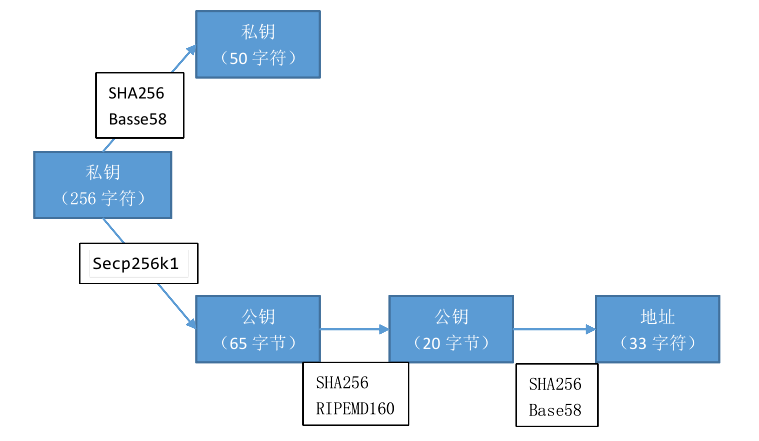

# 加密技术简要介绍

[TOC]

在区块链中加密技术中，主要用到了两种加密方式：

- 散列（哈希）算法(详见[散列算法](../../基础知识/散列算法.md))

- 非对称加密(详见[对称加密与非对称加密](../../基础知识/对称加密与非对称加密.md))

严格意义上讲，散列算法并不是加密方式，只是用于将任意长度的输入变换成固定长度且不可逆的输出单向密码体制。在区块链中用于生成公钥和私钥，非对称加密技术则被用于通过私钥生成公钥。

以比特币系统为例，其非对称加密机制可表示为：

1. 比特币系统一般通过调用操作系统底层的随机数生成器来生成256 位随机数作为私钥。比特币私钥的总量大，极难通过遍历全部私钥空间来获得存有比特币的私钥，因而密码学是安全的。为便于识别，256 位二进制形式的比特币私钥将通过SHA256 哈希算法和Base58 转换，形成50个字符长度易识别和书写私钥提供给用户。
2. 比特币的公钥是由私钥首先经过Secp256k1椭圆曲线算法生成65 字节长度的随机数。该公钥可用于产生比特币交易时使用的地址，其生成过程是首先将公钥进行SHA256和RIPEMD160双哈希运算生成20字节长度的摘要结果(即Hash160的结果)，再经过SHA256 哈希算法和Base58转换形成33字符长度的比特币地址。

公钥生成过程是不可逆的，即不能通过公钥反推出私钥。比特币的公钥和私钥通常保存在比特币钱包文件，其中私钥最为重要。丢失私钥就意味着丢失了对应地址的全部比特币资产。

## 区块链拓展散列算法

### SHA-3

**应用场景**：

- [以太坊生成公钥及地址](../../公链/Ethereum/以太坊白皮书.md)

**优点**：安全性

**缺点**：待查

### Bech32/Base32编码

**应用场景**：

- [Askcoin生成ASK地址](../../公链/Askcoin/Askcoin白皮书.md)

**优点**：相比于Base58效率更高，功能更强大，易于读写，支持二维码

**缺点**：比Base58多占17%空间

### X13算法（blake，bmw，groestl，jh， keccak，skein，luffa，cube-hash等）

**应用场景**：

- [DeepOnion生成公钥及地址](../../公链/DeepOnion/DeepOnion白皮书.md)

**优点**：相比于SHA-256更安全（次数多）

**缺点**：效率问题

### scrypt

**应用场景**：

- [莱特币地址生成](../../公链/LiteCoin/莱特币白皮书.md)

**优点**：安全性高

**缺点**：计算所需时间长，占用的内存多，并行计算多个摘要异常困难

## 区块链拓展的加密技术

### zk-snarks加密算法

**应用场景**：

- [AMBR加密交易](../../公链/AMBR/AMBR白皮书.md)

**优点**：待查

**缺点**：匿名性交易是非常迟缓

**发展新形式**：Jubjub-新型椭圆曲线，使用了数学来削减交易创建所需要的时间，比zk-snarks快4倍，内存减少98倍。

### Ed25519签名算法

**应用场景**：

- [Askcoin公钥生成](../../公链/Askcoin/Askcoin白皮书.md)
- [RootStock可拓展性](../../公链/RootStock/RootStock白皮书.md)
- Zcash
- Factom
- NEM
- 以太坊新版本计划切换此算法

**优点**：相较于secp256k1更加高效、安全性更高

**缺点**：待查

### NeoQS(抗量子密码学机制)

**应用场景**：

- [NEO抗量子密码学机制](../../公链/NEO/NEO白皮书.md)

**优点**：相较于ECC更加不可被量子计算机破解

**缺点**：待查

### Curve25519算法

**应用场景**：

- [NXT密码图谱基础](../../公链/NXT/NXT白皮书.md)

**优点**：通过使用非常快速、高效、高安全性的椭圆曲线数字签名实现私钥生成

**缺点**：待查
